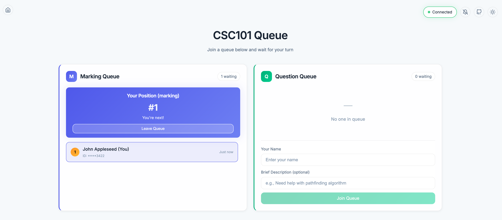
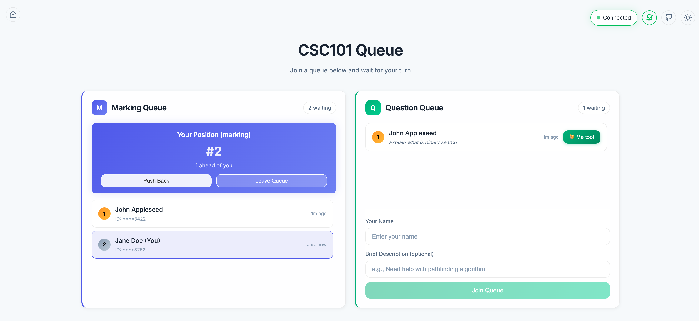
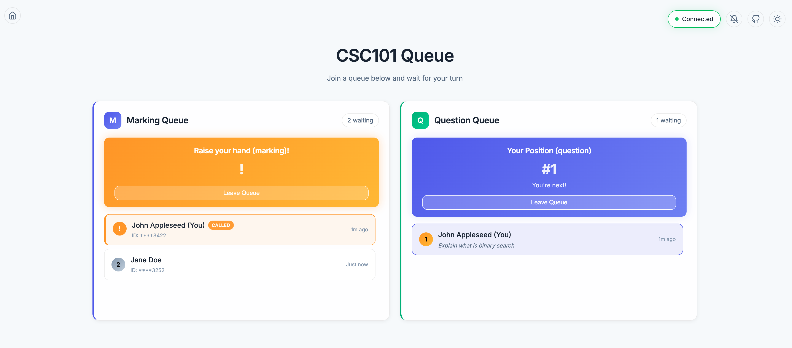
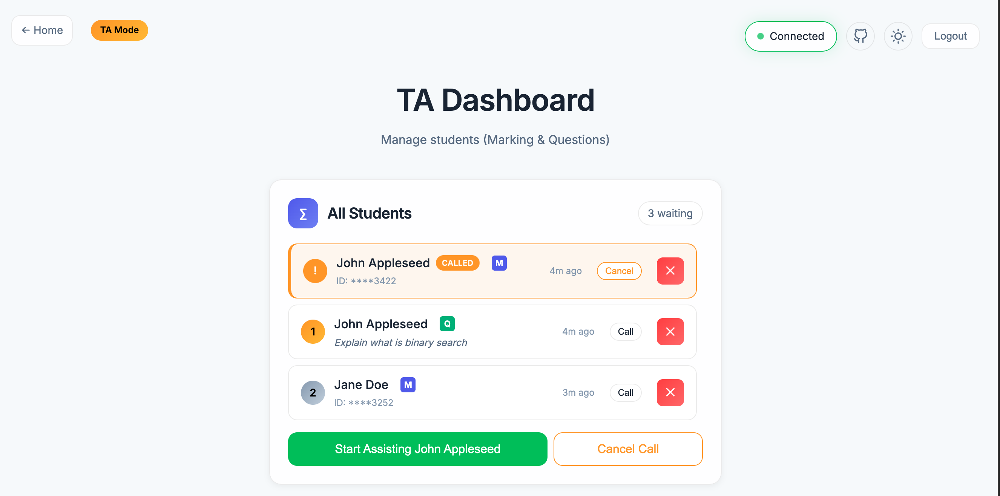

# In-person School Queue Management System

A real-time queue management system for TA practical sessions. Built with React + Socket.IO.



## Features

- 📝 **Dual Queues**: Separate queues for marking and questions
- ⚡ **Real-time Updates**: No page refresh needed
- 🔔 **Browser Notifications**: Get notified when your turn approaches
- 🔗 **Connection Indicator**: Know your connection status at a glance
- 👨‍🏫 **TA & Student Views**: Toggle between perspectives
- 📱 **Responsive Design**: Works on desktop and mobile
- 🌙 **Dark Mode**: Switch between light and dark mode


## Screenshots
Students can join the queue and wait for their turn. If they see similar questions get asked, they can follow the question and get notified when it is answered.



When student get called, they will receive a notification and can raise their hand.



TA can view the queue and call the next student. They can also cancel the call if the student is not ready.



## Stress Test

The system has undergone extensive stress testing using Cypress end-to-end tests. These tests simulate multiple students and TAs interacting with the system simultaneously—joining queues, switching between types (marking/questions), being called, and managing rapid updates. The app was able to handle dozens of concurrent users adding, removing, and updating questions in real time, ensuring that all state changes were reflected without data loss or UI glitches.

Example cypress scenarios include:
- Simulating 100+ students joining and leaving the queue in rapid succession
- Handling network disconnects and reconnections gracefully
- Ensuring the queue state stays consistent across all connected clients

These tests give confidence that the queue management logic is robust and performs well even under heavy classroom usage.

## Quick Start

### 1. Install Dependencies

```bash
# Frontend
npm install

# Backend
cd server
npm install
```

### 2. Start the Server

```bash
cd server
npm run dev
```

The server will start on `http://localhost:3001`

### 3. Start the Frontend

In a new terminal:

```bash
npm run dev
```

The app will open at `http://localhost:5173`

## Usage

### For Students

1. Open the app in your browser
2. Enable notifications when prompted
3. Fill in your name and last 4 digits of student ID (for marking queue)
4. Click "Join Queue"
5. Wait for your turn - you'll receive notifications as you move up

### For TAs

1. Click "TA View" in the toggle
2. See both queues with all students
3. Click "Check In Next" to call the next student
4. Use the ✕ button to remove specific students if needed

## Tech Stack

- **Frontend**: React + Vite
- **Backend**: Express + Socket.IO
- **Styling**: Vanilla CSS with modern design

## Environment Variables

Create a `.env` file in the root:

```
VITE_SOCKET_URL=http://localhost:3001
```

For production, set this to your server URL.

## Deployment

### Frontend (Vercel/Netlify)

```bash
npm run build
```

Upload the `dist` folder.

### Backend (Railway/Render/Fly.io)

Deploy the `server` folder as a Node.js application.

## License

MIT - Feel free to use and modify for your TA sessions!

## Contributing

PRs welcome! This is an open-source project for educational use.


## Disclaimer

The majority of the code in this project is generated by large language models (LLMs). Please review and use at your own risk, and verify critical logic as needed.